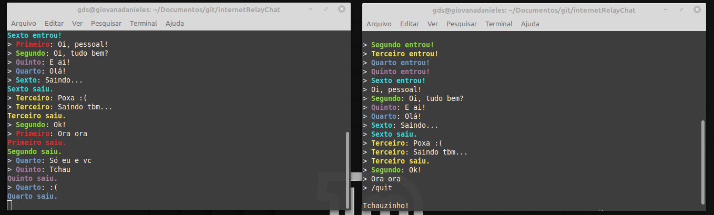
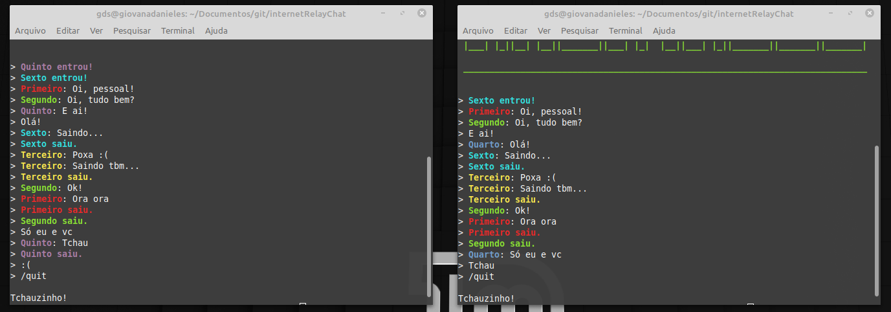
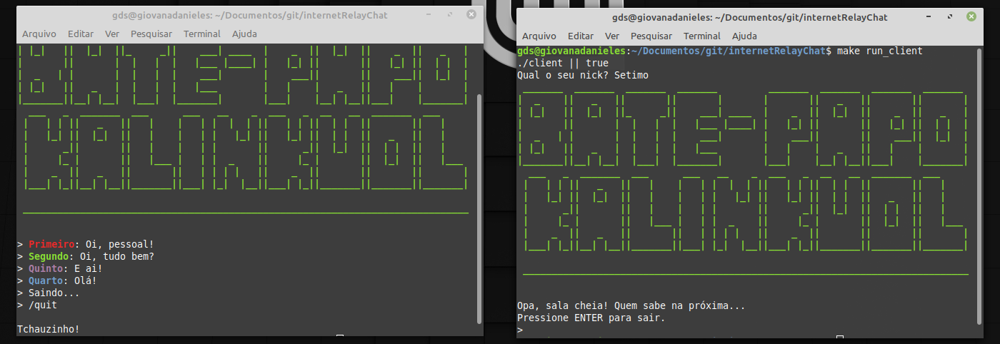
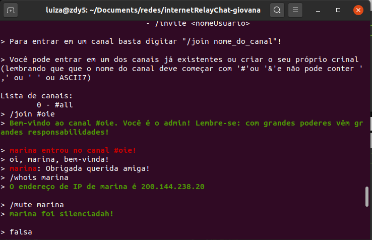

# internetRelayChat - KALINKUOL

Neste projeto estão implementadas as diversas partes que compõem um cliente e servidor IRC, ou Internet Relay Chat, amplamente utilizado na década de 90 e até hoje por alguns grupos de computação.

A implementação feita é uma adaptação das especificações dadas pelo RFC 1459, que define o IRC. O protocolo IRC tem sido desenvolvido em sistemas utilizando o protocolo TCP/IP e é um sistema que deve suportar múltiplos clientes conectados em um único servidor, realizando a multiplexação dos dados recebidos por eles.
 

<h3>Alunas</h3>
Giovana Daniele da Silva		&nbsp;&nbsp;&nbsp;&nbsp;&nbsp;&nbsp;&nbsp;&nbsp;&nbsp;&nbsp;&nbsp;&nbsp;&nbsp;&nbsp;&nbsp;&nbsp;&nbsp;&nbsp;&nbsp;&nbsp;10692224 
Luiza Pereira Pinto Machado		&nbsp;&nbsp;&nbsp;&nbsp;&nbsp;&nbsp;&nbsp;&nbsp;&nbsp;&nbsp;&nbsp;&nbsp;&nbsp;&nbsp;&nbsp;&nbsp;7564426 
Marina Fontes Alcântara Machado		&nbsp;&nbsp;&nbsp;&nbsp;&nbsp;10692040 

<h3>Sistemas Operacionais</h3>: Ubuntu 20.04 

: Mint 19.3 
<h3>Compilador</h3>: GCC 7.5.0 

<h3>Para compilar</h3>
<ul>
	<li>cliente e servidor: make</li>
	<li>cliente: make client</li>
	<li>servidor: make server</li>
</ul>
<h3>Para executar</h3>
<ul>
	<li>servidor: make run_server ou ./server</li>
	<li>cliente: make run_client ou ./client 'IP_servidor'</li>
</ul>

<strong>&#x1F534; O servidor deve ser executado antes de qualquer cliente.</strong> 

 <h3>Considerações</h3>

<ul>
	<li>As mensagens foram quebradas em 2048 caracteres, sendo 4096 o tamanho máximo suportado (por conta da limitação do buffer do terminal);</li>
	<li>Definimos como 10 o número máximo de clientes e 5 o número máximo de canais suportados pelo servidor. Entretanto, como estes valores são macros, é possível alterá-los a qualquer momento;</li>
	<li>O "pong" só é retonardo ao usuário que enviou o "/ping", assim como o "/ping" não é exibido para os demais usuários;</li>
	<li>Os comandos gerais disponívels no chat são: /join nomeCanal, /nickname novoNick, /ping, /quit e /quichannel;</li>
	<li>Os comandos de administrador disponíveis são: /kick nomeUsuario, /mute nomeUsuario, /unmute nomeUsuario, /whois nomeUsuario, /mode +i|-i e /invite nomeUsuario;</li>
	<li>É possível criar canais públicos (padrão, /mode -i) e também invite-only (/mode +i);</li>
	<li>Utilizando <em>port forwarding</em> é possível disponibilizar o server em uma porta pública e, assim, possibilitar a conexão de clientes de diferentes redes. </li>
    <li>No makefile, foi utilizado o endereço IP local 127.0.0.1 como exemplo, mas, para conexões entre diversos hosts, ele deve ser modificado para o endereço do servidor.</li>
</ul>

 

<h3>Sobre port forwarding</h3>

Utilizando um roteador D-Link DI-524, foi criado um virtual server para o Kalinkuol na porta 8192, permitindo que requisições feitas ao endereço público do servidor fossem devidamente redicionadas a ele pelo dispositivo. Para efetivamente permitir que o endereço fosse acessível, o servidor foi colocado na DMZ da rede interna.

  

<h3>Demo</h3>
<!--  
img src = "images/IRC2.png"> 
 
  -->

